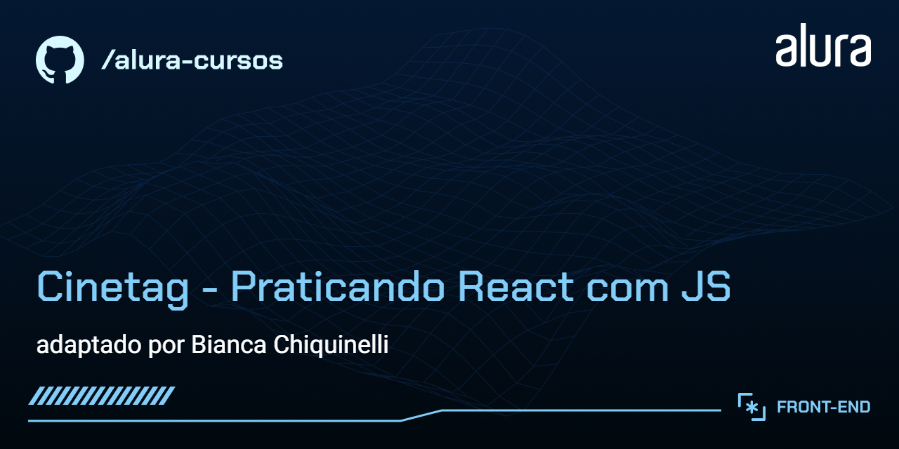

# CineTag



O CineTag é uma plataforma fictícia de streaming focada em conteúdos de tecnologia, com navegação dinâmica entre páginas e interação com um catálogo de vídeos.

**A aplicação inclui funcionalidades como:**

- Navegação entre páginas com roteamento dinâmico
- Visualização de vídeos em página de player
- Marcação e listagem de vídeos favoritos
- Tratamento de rotas inexistentes (página de erro)

## Minhas Contribuições

- Estruturação de rotas com separação de responsabilidades via PaginaBase
- Gerenciamento de estado global com `Context API` para funcionalidade de favoritos
- Consumo e adaptação de API fake remota
- Renderização dinâmica de componentes a partir de dados
- Implementação de páginas:
  - Player de vídeo
  - Página de erro (fallback de rota)
- Separação de responsabilidades entre páginas e componentes
<p align="center">
  
  
</p>

## Tecnologias Utilizadas

- React
- Vite
- React Router DOM

## ⚙️ Técnicas e abordagens

- **Gerenciamento de estado:** uso de `Context API` para controle global da lista de favoritos, evitando prop drilling e centralizando a lógica de atualização
- **Fluxo de dados:** consumo de API remota com `useEffect`e renderização reativa via`map`
- **Arquitetura de componentes:** separação entre páginas e componentes reutilizáveis, com abstração de layout via PaginaBase
- **Roteamento:** navegação com `React Router DOM`, incluindo rotas dinâmicas e fallback
- **Responsividade:** adaptação do layout para dispositivos móveis (até 700px)
- **Manutenibilidade:** refatoração de componentes após integração com API e correções estruturais (imports, case-sensitive, organização de pastas)

## Como Ter Acesso ao Projeto

- **Versão online**: [Clique aqui](https://cinetag-two-theta.vercel.app/)
- **Rodar localmente**:

1. Clone este repositório:

```bash
   git clone https://github.com/chiquinelli-bia/cinetag.git

```

2. Acesse a pasta do projeto:

   ```bash
   cd cinetag

   ```

3. Instale as dependências:

   ```bash
   npm install

   ```

4. Inicie o servidor de desenvolvimento:

   ```bash
   npm run dev

   ```

5. Abra no navegador o endereço exibido no terminal e Navegue pelas funcionalidades implementadas.

## Créditos

- Projeto base: 
- Curso: 
- Este repositório destaca **apenas minhas contribuições** ao projeto
